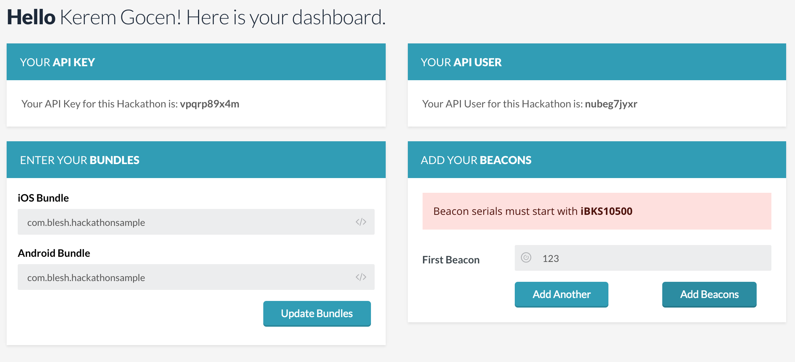
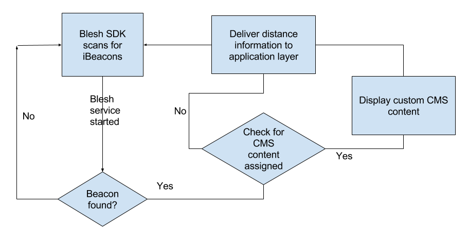

Blesh SDK github repository dedicated to GarantiHackathon

## Welcome

Hello everyone, Blesh is pleased to welcome you all curious hackers!

If you would like to use iBeacons as part of your project, we have created this repo will guide you through the process.

First, go to our hackathon [register page](http://hackathon.blesh.com/) to claim your account. Once you're done with that, you'll be able to register your beacons(which you can acquire from our boot during the hackathon) and your application into our system, which will allow you to gather beacon distances from your application using our SDK.

Here is the list of information you should provide once you login successfully to hackathon.blesh.com;



- iOS and/or Android Bundle

Enter your applications bundle name (your.bundle.com)

- A list of serial numbers of your beacons(in the back, starting with iBKS..)

You just have to enter these serials manually

- Api key
- Api user

The Api key and user information will be generated for you in the dashboard, you should simply copy those and use it in your application when you're starting the Blesh service, as you can see [here](docs/howto_android.md).

# Android
```
startService(new BleshIntent.Builder("your_api_key", "your_api_user", "some_id").optionalKey("M").getIntent(this));
```

# iOS
```
[[Blesh sharedInstance] initBleshWithAPIUser:@"your_api_user"
                                           APIKey:@"your_api_key"
                                           integrationType:@"M"
                                           integrationId:@"some_id"];
```

Please note that all fields are String objects.

## Usage

In order to scan for beacons within your proximity and display content based on micro location, you should integrate Blesh SDK into your project. Please see our [wiki pages](docs/howto.md) for platform specific information and example project.



## What is iBeacon?

iBeacon is a small low powered Bluetooth Smart chip, which will advertise it's id periodically constantly. We are using it for micro location services. Each beacon can be associated with the micro location that it's placed. You can then scan these beacons using our SDK, get beacon specific information such as the distance from your device and act on it(show notifications, setup triggers based on location or beacon etc., use your imagination!).

## What is CMS?

[Blesh CMS](http://beacon.do/) is our backend service that provides content, again based on micro location. You can make your app load a url when it encounters a certain beacon, you can display custom visual content based on the time of day or you can even create a treasure hunt application using our CMS.

See our detailed documentation [here](docs/cms/BleshCMS_intro_eng.md) for in depth information about our CMS.

