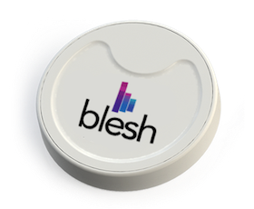

Blesh SDK github repository dedicated to GarantiHackathon

## Quick Start (Hello IoT!)

1. Go [register and login](http://hackathon.blesh.com/)!
2. Copy your Api Key and Api User from your dashboard.
3. Grab the sample project for [Android](Android/HackathonSample) or [iOS](iOS/HackhatonSample) and use your api key/user pair as shown [here](docs).
4. Enter your application's bundle name using your dashboard.
5. Register your beacons using your dashboard. You can get them from Blesh staff during the hackathon.
6. Run your app and embrace the power of BLE. Welcome to IoT!

## Welcome

Hello everyone, Blesh is pleased to welcome you all curious hackers!

If you want to use iBeacons in your project, we have created this guide to walk you through the process.

First, go to our hackathon [register page](http://hackathon.blesh.com/) to claim your account. Once you're done with that, you'll be able to register your beacons(which you can acquire from our booth during the hackathon) and your application into our system, which will allow you to gather beacon distances from your application using our SDK.

- [How does it work?](#how-does-it-work)
- [How can I use Blesh SDK with my application?](#how-can-i-use-blesh-sdk-with-my-application)
- [What do you mean by close proximity?](#what-do-you-mean-by-close-proximity)
- [What can i do with Blesh SDK and iBeacons?](#what-can-i-do-with-blesh-sdk-and-ibeacons)
- [What is iBeacon?](#what-is-ibeacon)
- [What is Blesh CMS?](#what-is-blesh-cms)

Here is the list of information you should provide once you login successfully to hackathon.blesh.com;


- iOS and/or Android Bundle

Enter your application's bundle name (your.bundle.com)

- A list of serial numbers of your beacons(in the back, starting with iBKS..)

You just have to enter these serials manually

- Api Key
- Api User

The Api key and user information will be generated for you in the dashboard, you should simply copy those and use it in your application when you're starting the Blesh service, as you can see in our [Android](docs/howto_android.md) and [iOS](docs/howto_ios.md) docs.

### Android
```
startService(new BleshIntent.Builder("your_api_key", "your_api_user", "some_id").optionalKey("M").getIntent(this));
```

### iOS
```
[[Blesh sharedInstance] initBleshWithAPIUser:@"your_api_user"
                                           APIKey:@"your_api_key"
                                           integrationType:@"M"
                                           integrationId:@"some_id"];
```

Please note that all fields are String objects.

Please see platform specific documents if you want to use Blesh SDK in your own hackathon project!

## How does it work?

Blesh SDK is distributed as a library project. It works as a service in the background of your application process, periodically scanning for Blesh iBeacons within close proximity. When Blesh SDK detects a beacon, your application will receive distance and id information for the detected beacons through the callback you'll implement. You may also display visual content using our [CMS](docs/cms/BleshCMS_intro_eng.md).

## How can I use Blesh SDK with my application?

[Blesh Integration for iOS](docs/howto_ios.md)

[Blesh Integration for Android Studio](docs/howto_android.md)

## What do you mean by close proximity?

Our range is ~50 meters, depending on environmental conditions.

## What can i do with Blesh SDK and iBeacons?

You can scan for beacons within your telephone's range and get beacon distance information in your application and you can also display custom content (we call them templates) using Blesh CMS.

In order to scan for beacons within your proximity and display content based on micro location, you should integrate Blesh SDK into your project. Please see our docs for platform specific information and example projects.

*Hint: You can use our empty projects as a baseline for your hackathon apps, they are simply empty projects that comes with already integrated Blesh SDK. One for each platform(iOS/Android).


## What is iBeacon?

iBeacon is a small low powered Bluetooth Smart chip, which will advertise it's unique id periodically, until it runs out of battery(~3 years). We are using it for micro location services. Each beacon can be associated with the micro location that it's placed at. You can then scan these beacons using our SDK, get beacon specific information such as the distance from your device and act on it(show notifications, setup triggers based on location or beacon id etc., use your imagination!).



## What is Blesh CMS?

[Blesh CMS](http://beacon.do/) is our backend service that provides content, again based on micro location. You can make your app load a url when it encounters a certain beacon, you can display custom visual content based on the time of day or you can even create a treasure hunt application using our CMS.

See our detailed documentation [here](docs/cms/BleshCMS_intro_eng.md) for in depth information about our CMS.


Good luck and have fun!

- Blesh

