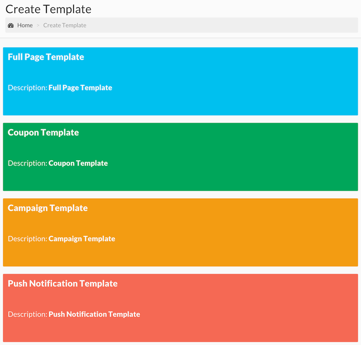
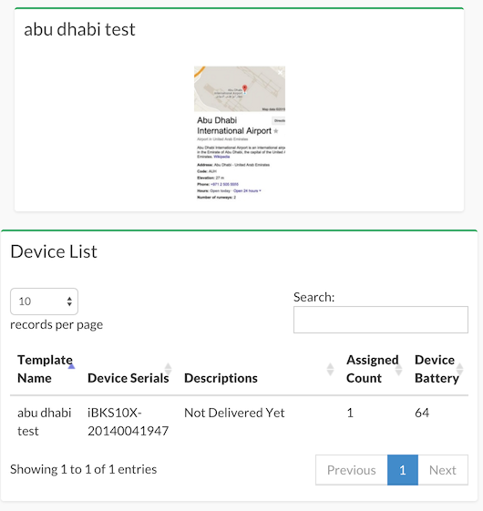

**BLESH CMS**

Administration Guide

[[TOC]]

# Purpose

You will find introductory information in this document, about Blesh CMS(content management service).

# Solution

Blesh beacons use Bluetooth Smart technology which is compatible with devices using iOS 7.0+ and Android 4.3+ operating systems.

Blesh SDK, is our way to communicate these Bluetooth Smart compatible phones with our beacons. Our SDK, can be deployed in any mobile application in order to provide this communication for our users.

In this document, you will find detailed information about the structure of this communication and how to use Blesh CMS platform to orchestrate this communication.

# Blesh CMS, a brief look

## Login

Blesh CMS is a web based application accessed via [http://beacon.do/](http://beacon.do/) which could be deployed on a Unix based server at a preffered location for our clients. Use your authorized username and password, which will be provided by Blesh, to login your Blesh CMS panel.

 

## Template Manager

Blesh CMS, will be the web based user interface to generate rich visual content that we call "templates" and assign them to your dedicated beacons in the field. These templates then can be displayed by mobile applications those integrate Blesh SDK.

When creating these templates, you can;

* Choose from various different styles (ie. Full page, Campaign, Push Notification templates)

* Background pictures

* Color of buttons and text

* Crop and edit your uploaded images

* Preview your templates for mobile phones with various screen resolutions

After you edit and save your templates, you can assign them to specific or multiple beacons in your account to display your users. 

### Creating Templates

Full page templates can be used to display larger content for example content that may include relatively larger text. On top of editing various content settings, you may choose the resulting action of your buttons. Such as you may want to load a specific URL once your users click on a button.

Once you create your template with your desired content and settings, you can preview how your campaign will look on various different devices both for iOS and Android platforms.

Next up, after you save your template, Template Manager page provides higher level settings such as;

* Minimum frequency (in seconds)

* Maximum number of times to display your templates

* Expire date

* Duration (amount of time to display your template, after a user comes within the proximity of your assigned beacon)

You can also view and filter your saved templates from the same page.

### Assigning templates to your beacons

In order to assign your template to your beacons, click on "Assign Template" and pick devices you want that template to be broadcasted from.

The general template settings those include frequency and show counts, can be overridden for specific templates. Also note that, when choosing a beacon for template assignment you can specify the desired distance to further customize the experience.

## Device Assign Map

This map will show an overview of your templates and their assigned beacons, as well as battery status of your beacons in the field.

## Vendor Settings

Vendor settings screen can be used to provide bundle information for your field apps those will integrate with Blesh SDK. You may provide multiple bundle names for each platform by putting ";" between two bundle names. (ie. “com.bundle1;com.bundle2”)

